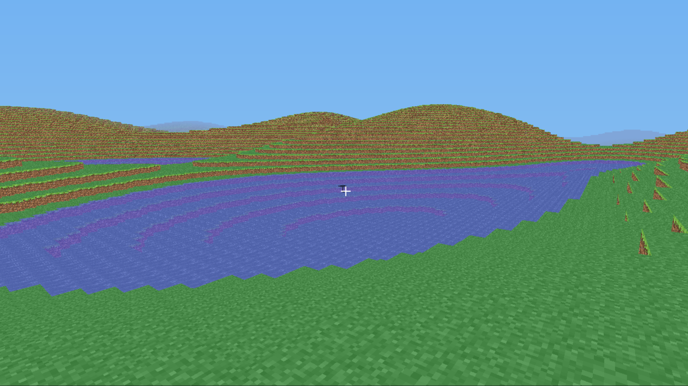

# lambdacubed $\lambda^3$

A small reimplementation of early Minecraft in pure Haskell using OpenGL.

## How to run

Since I neither have the licenses to the original textures, nor the talent to create my own, anyone wanting to run this must acquire a copy of a 16x16 resource pack and place it in this directory. The default minecraft one is what is used in the pictures. Since some textures are greyscale and colored in the shaders based on the environment, some extra textures will need to be created before running the project.

The project contains the setup_textures.sh script that uses imagemagick to perform this conversion. After this, just use cabal run to start the game.

## TODO
Things that would be nice to have if I find the time or anyone else feels like contributing them:
- [ ] Nicer code for handling the game state
- [ ] More biomes in terrain generation (requires more blocks)
- [ ] Loading of maps from original minecraft map files (requires more blocks)
- [ ] Biome-based shading of textures.

## Known bugs
- [ ] Player can place blocks inside himself.
- [ ] World generation repeats vertically.
- [ ] Side vertices of water are part of water mesh, even if they border water on the side. This is the same behavior as for the opaque block mesh, but in this case it is a problem.
